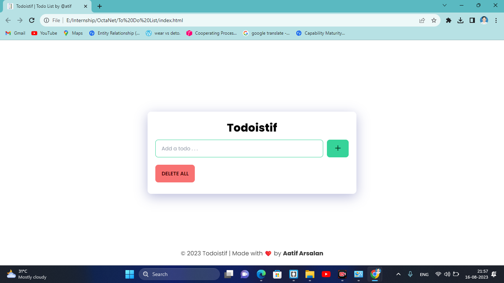
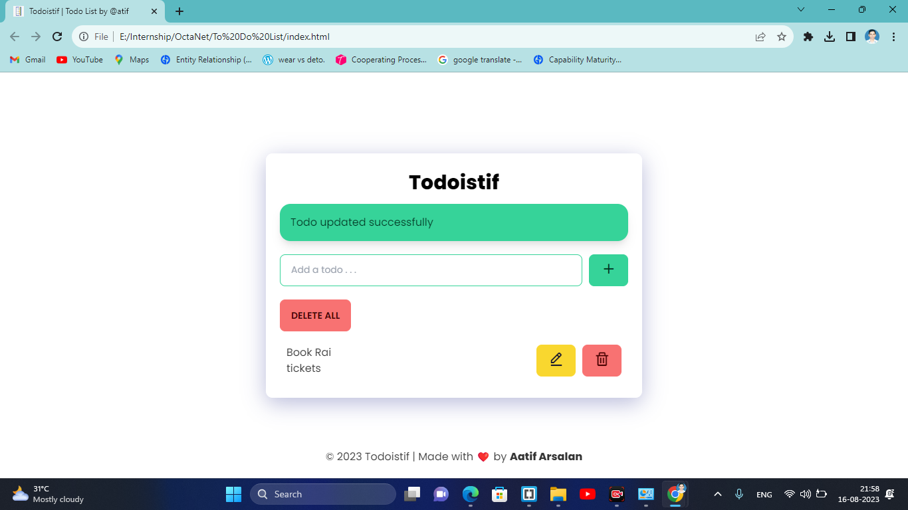
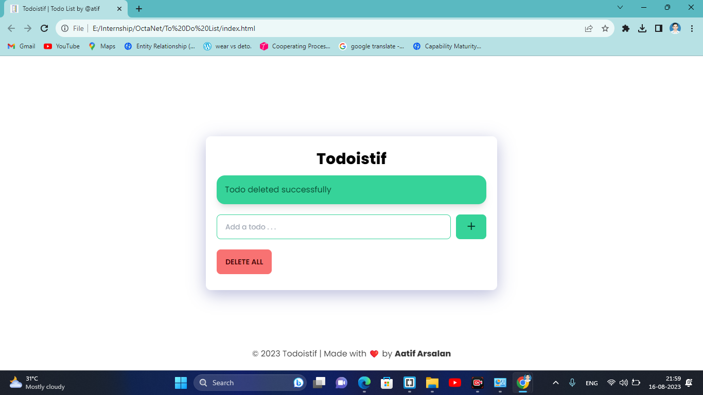

# OCTANET_AUGUST_ToDoList Simple Todoistif (Todo List by Aatif) Web App with HTML, CSS and JavaScript.

# Features

Add new todos with a user-friendly interface.
Mark todos as completed.
Delete completed todos or those no longer needed.
Save todos to the local storage.

# Software Requirements :
IDE - Brackets
Tech Stack : HTML5, CSS3, JavaScript & Bootstrap4

Show some ❤️ by starring this repo.!

